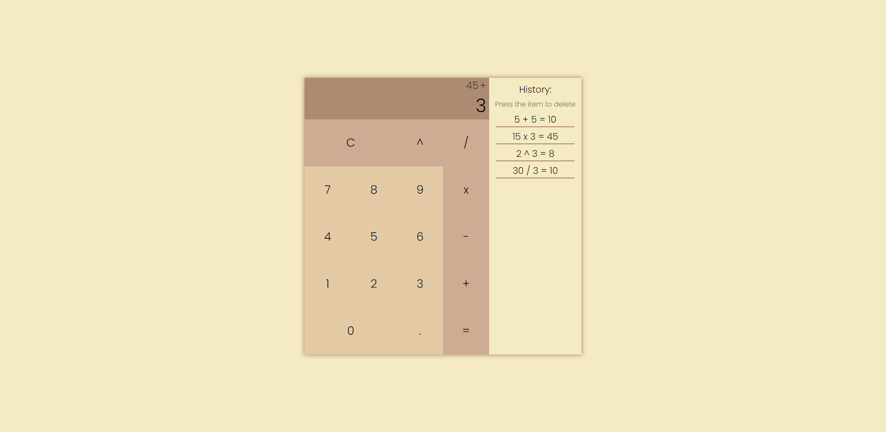

# Calculator

## :mag: Overview

This project is a calculator. It allows you to perform basic calculations such as addition, subtraction, multiplication, division and multiplication.

It saves the results of recent actions, which can be deleted by clicking on the selected one.

See the live version of my [calculator]().

## :bulb: Technologies


## :dizzy_face: Problems

The biggest challenge proved to be doing the calculations. Here I used the switch conditional instruction, which allowed to write the conditions clearly.

```
    switch(operator) {
        case '^': result = b ** a; break;
        case '/': result = b / a; break;
        case 'x': result = a * b; break;
        case '-': result = b - a; break;
        case '+': result = a + b; break;
    }
```